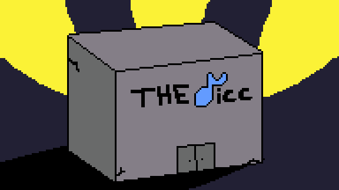
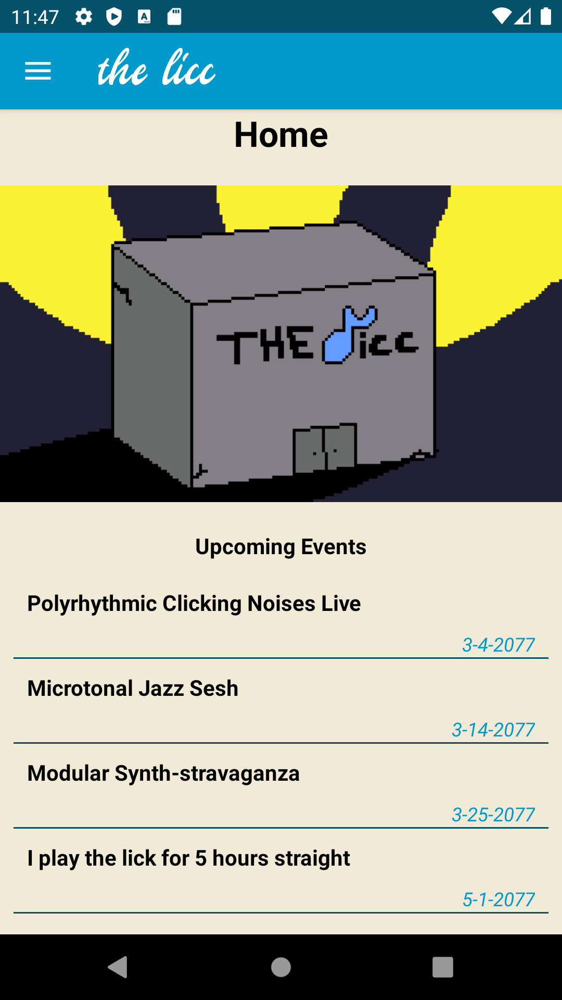
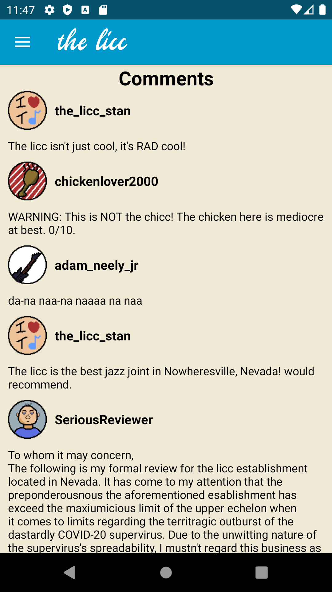
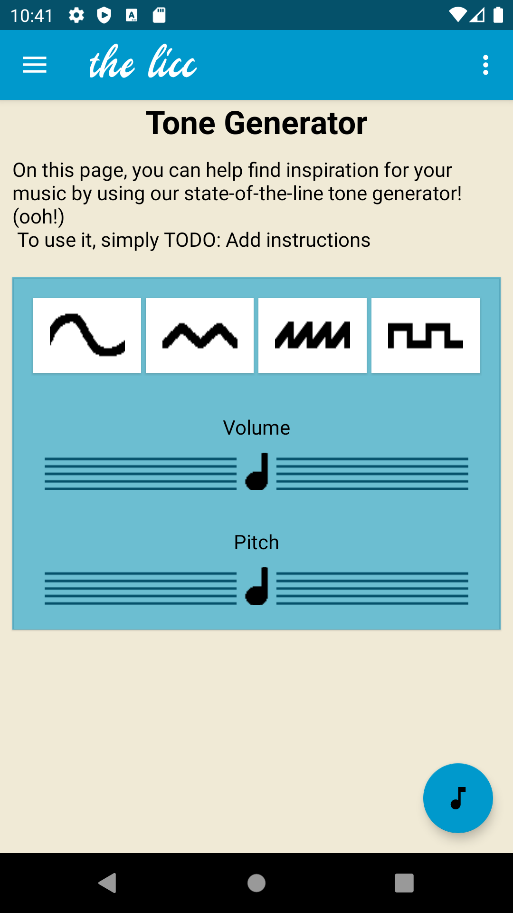
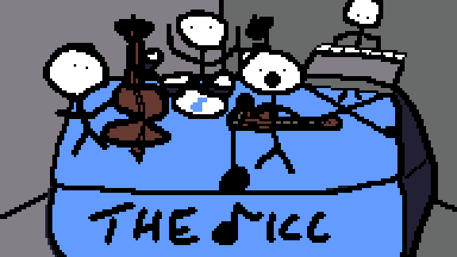
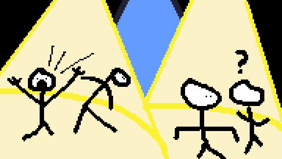

# welcome to the licc
### a microtonal jazz joint by Zachary Allard

the licc is a hot gathering spot for musicians of all skill levels, located in downtown Nowheresville, Nevada. It opened its doors in 2040.
Although it is obviously currently closed due to the outbreak of the dastardly COVID-20 supervirus, the venue typically hosts a variety of events aimed towards a wide variety of music fans from all walks (insert bass guitar joke) of life.
Given how nothing can currently be hosted in person, the owners of the licc decided to hire a team to develop a brand new app to build hype for the venue for when those doors finally reopen.
While the app will contain the standard information about the business (name, photos, events, things you can do), it will also contain something that the owners think will really bring people in: a (not-so) fancy tone generation program. They claim that this will be a really big hit due to the abundance of microtonal jazz music that exploded in popularity in 2077.
It is your duty to help shape the jazz music of the future.

## so how do I use this app?
It's easy! All you need to get started is an Android device running Android Marshmallow (6.0) or higher.

To get started, you might want to check out the upcoming events and venue images on the main page. Snazzy! 

If you want to share you thoughts, mosey on over to the comments page: 

If social lives aren't your thing, maybe you play around with the meat-and-potatoes of the app: the Tone Generator! Wow! 
 
To use it, simply drag around the sliders until you find something that tickles your fancy. Consider your fancy tickled.

### The licc is a place for musicians of all types, as long as your music is weird and made using obscure musical concepts!
#### Come visit whenever you want to have a good time!

## License
This app uses code that is licensed under Apache 2.0.
